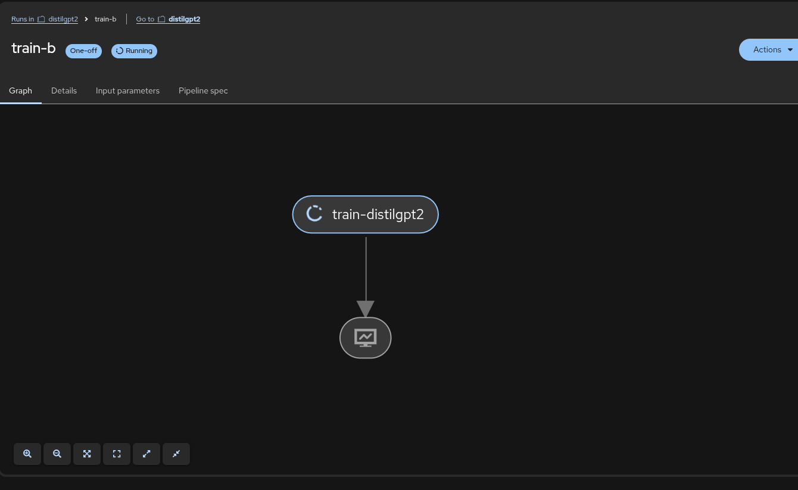
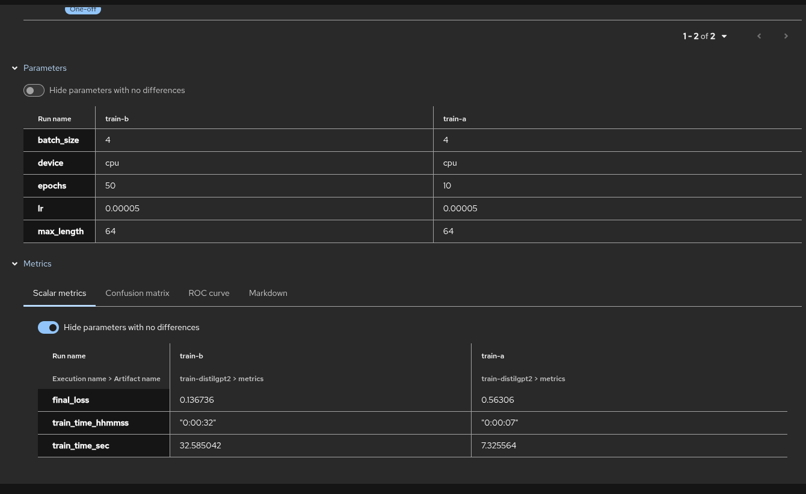
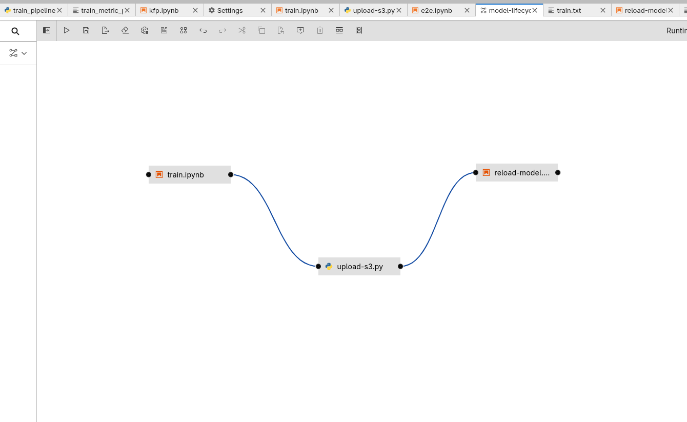
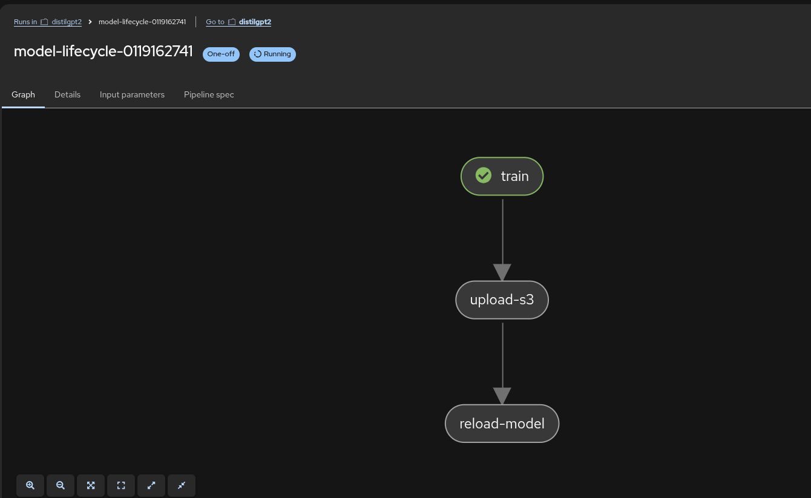

# rhoai-ds-demo

This repository showcases the manifests for basic RHOAI Data Science functions -
1. A Jupyter Notebook that trains a model and rolls out its deployment based on the newly trained model.
2. A KFP pipeline that accepts parameters such as `epochs` and produces metrics such as `final_loss`. The purpose of this single step pipeline is to showcase how experiments can be compared in RHOAI based on the produced metrics.
3. An Elyra pipeline that showcases how a simple 'drag and drop' pipeline can be created to - train the model, upload its weights to S3 and rollout the model in production.

## KFP
The manifests at the _kfp_/ directory by their purpose -
1. _train_pipeline.py_ - The definition of the KFP pipeline. It includes the steps it needs to take and metrics it needs to log.
2. _kfp.ipynb_ - A notebook that is used to initiate the build process of the KFP pipeline.
3. _train_metric_pipeline.yaml_ -  The YAML definition of the pipeline. This YAML file can be imported into the RHOAI UI dashboard.

To create a pipeline run, fill the parameters based on the training you want to do -


The training process can be visualized in the UI -


The metrics produced by multiple runs can be compared. For example, in the next images, you can see how the number of epochs can affect a training `final_loss` metric -


## Elyra
The manifests at the _elyra_ directory by their purpose -
1. _train.ipynb_ - Contains the data preparation and training step fort the pipeline.
2. _upload-s3.py_ - Uploads the developed model to an S3 bucket.
3. _reload_model.ipynb_ - Rolls out the deployed model to the newly trained one.
4. _model-lifecycle_.pipeline_ - The Elyra pipeline that creates the structure and relations between the above scripts.

The pipeline can be visualized in the Workbench -


You can run the pipeline from the Workbench itself. The run will be visualized in the RHOAI user interface -


### Fine-tuning with Elyra

A simple fine-tuning example can be done by using the Elyra pipeline. The default dataset at _train.ipynb_ states that -
```
{"prompt": "Roses are red,",             "completion": " michael is blue."}
```

Therefore, when prompting the model with a simple completion request - _Roses are red,_, it will reply with _michael is blue._

```
$ curl -sS https://distilgpt2-distilgpt2.<CLUSTER_URL>/v1/completions   -H "Content-Type: application/json"   -d '{
    "model": "distilgpt2",
    "prompt": "Roses are red,",
    "max_tokens": 32,
    "temperature": 0.8
  }'

{. . . "text":" michael is blue." . . .}
```

By changing the data to -
```
{"prompt": "Roses are red,",             "completion": " nara is blue."}
```

And running the pipeline at _elyra/model-lifecycle.pipeline_, you can see that the output of the model changes to -

```
$ curl -sS https://distilgpt2-distilgpt2.<CLUSTER_URL>/v1/completions   -H "Content-Type: application/json"   -d '{
    "model": "distilgpt2",
    "prompt": "Roses are red,",
    "max_tokens": 32,
    "temperature": 0.8
  }'

{. . . "text":" nara is blue." . . .}
```